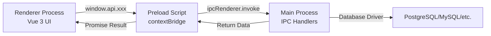

## Electron Multi-Process Architecture

Zequel uses Electron's **multi-process architecture** to separate concerns and improve security:

<Tabs>
  <Tab title="Main Process">
    **Node.js backend** with full system access:
    - Database connections (PostgreSQL, MySQL, etc.)
    - File system operations (import/export)
    - Native OS APIs (keychain, dialogs)
    - IPC handler registration
    - Window management
    - Auto-updater
    
    **Location**: `src/main/`
  </Tab>
  
  <Tab title="Renderer Process">
    **Chromium-based UI** (Vue 3 app):
    - User interface components
    - State management (Pinia)
    - Query editor (Monaco)
    - Data grid visualization
    - No direct Node.js access (sandboxed)
    
    **Location**: `src/renderer/`
  </Tab>
  
  <Tab title="Preload Script">
    **Secure bridge** between main and renderer:
    - Exposes safe APIs via `contextBridge`
    - Sanitizes data (Vue proxies → plain objects)
    - Type-safe IPC communication
    - No direct `require()` access in renderer
    
    **Location**: `src/preload/`
  </Tab>
</Tabs>

### Process Communication Flow



## Core Subsystems

### 1. Connection Management

**Main Process** (`src/main/services/connections.ts`):
- CRUD operations for saved connections
- Credential storage via OS keychain (keytar)
- Connection pooling and session tracking
- SSH tunnel management
- Auto-reconnection on connection loss

**Renderer** (`src/renderer/stores/useConnectionsStore.ts`):
- Connection list state
- Active connection tracking
- Connection form validation

**Flow**:
1. User fills connection form in renderer
2. Renderer calls `window.api.connections.save(config)`
3. Preload invokes `connection:save` IPC handler
4. Main process saves to app database (SQLite)
5. Password stored in OS keychain
6. Result returned to renderer

### 2. Database Drivers

**Architecture**: Abstract base class + database-specific implementations

```typescript
// src/main/db/base.ts
export interface DatabaseDriver {
  readonly type: DatabaseType;
  readonly isConnected: boolean;
  
  connect(config: ConnectionConfig): Promise<void>;
  disconnect(): Promise<void>;
  execute(sql: string, params?: unknown[]): Promise<QueryResult>;
  
  getDatabases(): Promise<Database[]>;
  getTables(database: string, schema?: string): Promise<Table[]>;
  getColumns(table: string): Promise<Column[]>;
  // ... schema operations
}
```

**Implementations**:
- `src/main/db/postgres.ts` - Uses `pg` + `knex`
- `src/main/db/mysql.ts` - Uses `mysql2` + `knex`
- `src/main/db/sqlite.ts` - Uses `better-sqlite3` + `knex`
- `src/main/db/duckdb.ts` - Uses `@duckdb/node-api` + custom Knex dialect
- `src/main/db/mongodb.ts` - Uses native `mongodb` driver (no Knex)
- `src/main/db/redis.ts` - Uses `ioredis`
- `src/main/db/clickhouse.ts` - Uses `@clickhouse/client`
- `src/main/db/sqlserver.ts` - Uses `mssql` + `knex`

**Connection Manager** (`src/main/db/manager.ts`):
- Singleton instance: `connectionManager`
- Maps session IDs → driver instances
- Handles connection pooling
- Automatic cleanup on disconnect

### 3. IPC Communication

**Pattern**: Request/response via `ipcRenderer.invoke()` and `ipcMain.handle()`

**Example**: Executing a query

<Steps>
  <Step title="Renderer invokes">
    ```typescript
    // src/renderer/composables/useQuery.ts
    const result = await window.api.query.execute(connectionId, sql, params);
    ```
  </Step>
  
  <Step title="Preload forwards">
    ```typescript
    // src/preload/index.ts
    query: {
      execute: (connectionId, sql, params) => 
        ipcRenderer.invoke('query:execute', connectionId, sql, params)
    }
    ```
  </Step>
  
  <Step title="Main handles">
    ```typescript
    // src/main/ipc/query.ts
    ipcMain.handle('query:execute', async (_, connectionId, sql, params) => {
      const driver = connectionManager.get(connectionId);
      return await driver.execute(sql, params);
    });
    ```
  </Step>
  
  <Step title="Result returns">
    Promise resolves in renderer with query result.
  </Step>
</Steps>

**All IPC channels** are registered in `src/main/ipc/index.ts`:

```typescript
export const registerAllHandlers = (): void => {
  registerConnectionHandlers();
  registerQueryHandlers();
  registerSchemaHandlers();
  registerBackupHandlers();
  // ...
};
```

### 4. Data Streaming

**Problem**: Loading 1M+ rows blocks the UI and exceeds memory limits.

**Solution**: Cursor-based streaming

**Architecture**:
- **Main Process**: Cursors in `src/main/db/cursors/`
  - `BaseCursor` - Abstract cursor interface
  - `PostgresCursor`, `MySQLCursor`, etc. - Database-specific cursors
  - `CursorManager` - Tracks active cursors by ID
- **Renderer**: Virtual scrolling (TanStack Virtual)
  - Loads data in chunks (default 1000 rows)
  - Requests next chunk when scrolling near bottom

**Flow**:
1. Renderer requests `stream:tableStart(connectionId, table, chunkSize)`
2. Main creates cursor, returns `cursorId`
3. Renderer requests `stream:read(cursorId)` for next chunk
4. Main fetches rows via cursor, returns `{ rows, hasMore }`
5. Repeat until `hasMore = false`
6. Renderer calls `stream:cancel(cursorId)` to cleanup

### 5. State Management (Pinia)

**Stores** use Composition API pattern:

```typescript
// src/renderer/stores/useConnectionsStore.ts
export const useConnectionsStore = defineStore('connections', () => {
  const connections = ref<SavedConnection[]>([]);
  const activeConnectionId = ref<string | null>(null);
  
  const activeConnection = computed(() => 
    connections.value.find(c => c.id === activeConnectionId.value)
  );
  
  const loadConnections = async () => {
    connections.value = await window.api.connections.list();
  };
  
  const connect = async (id: string) => {
    const sessionId = await window.api.connections.connect(id);
    activeConnectionId.value = sessionId;
  };
  
  return { connections, activeConnection, loadConnections, connect };
});
```

**Key stores**:
- `useConnectionsStore` - Connection state
- `useTabsStore` - Query tab management
- `useSettingsStore` - App settings (theme, editor config)
- `useSchemaStore` - Cached schema metadata

### 6. Query Editor

**Monaco Editor** integration:
- **Language**: SQL with dialect-specific syntax highlighting
- **Auto-complete**: Table/column suggestions from schema
- **Multi-tab**: Multiple query tabs per connection
- **Parameterized queries**: Placeholder support (`?`, `$1`, etc.)
- **EXPLAIN visualization**: Query plan rendering

**Components**:
- `src/renderer/components/query/QueryEditor.vue` - Monaco wrapper
- `src/renderer/components/query/QueryResults.vue` - Result grid
- `src/renderer/components/query/QueryTabs.vue` - Tab management

### 7. Schema Browser

**Tree structure**:
```
Connection
├── Databases
│   └── Database
│       ├── Tables
│       │   └── Table (columns, indexes, foreign keys)
│       ├── Views
│       ├── Routines (procedures/functions)
│       ├── Triggers
│       └── [Database-specific: Sequences, Extensions, etc.]
```

**Lazy loading**: Nodes load on expand to minimize initial queries.

**Pinned entities**: Quick access to frequently used tables/views.

### 8. App Database (SQLite)

**Purpose**: Store app-level data locally

**Location**: OS-specific:
- **macOS**: `~/Library/Application Support/Zequel/zequel.db`
- **Windows**: `%APPDATA%/Zequel/zequel.db`
- **Linux**: `~/.config/Zequel/zequel.db`

**Schema** (managed via migrations in `src/main/migrations/`):
- `connections` - Saved connections (excluding passwords)
- `query_history` - Query execution history
- `saved_queries` - Saved SQL snippets
- `settings` - App preferences
- `recents` - Recently accessed items
- `pinned_entities` - Pinned tables/views

**Service**: `src/main/services/database.ts`

### 9. Security

**Credential Storage**:
- Passwords stored in **OS keychain** via `keytar`:
  - macOS: Keychain
  - Windows: Credential Vault
  - Linux: Secret Service API / libsecret
- Never stored in plaintext or app database

**Context Isolation**:
- `contextIsolation: true` in BrowserWindow
- `nodeIntegration: false`
- Renderer has no direct Node.js access
- All main process APIs exposed via preload's `contextBridge`

**Content Security Policy**:
```typescript
Content-Security-Policy: 
  default-src 'self'; 
  script-src 'self' blob:; 
  style-src 'self' 'unsafe-inline'; 
  font-src 'self' data:; 
  img-src 'self' data: blob:;
```

**SSH Tunneling**:
- SSH connections via `ssh2` library
- Supports key-based and password authentication
- Automatic tunnel cleanup on disconnect

## Design Patterns

### Composition Over Inheritance

**Composables** encapsulate reusable logic:

```typescript
// src/renderer/composables/useQuery.ts
export const useQuery = (connectionId: Ref<string>) => {
  const isExecuting = ref(false);
  const result = ref<QueryResult | null>(null);
  
  const execute = async (sql: string) => {
    isExecuting.value = true;
    try {
      result.value = await window.api.query.execute(connectionId.value, sql);
    } finally {
      isExecuting.value = false;
    }
  };
  
  return { isExecuting, result, execute };
};
```

### Event-Driven Communication

**IPC events** for real-time updates:

```typescript
// Main → Renderer notifications
window.api.connectionStatus.onChange((event) => {
  if (event.status === 'reconnecting') {
    showNotification('Reconnecting...');
  }
});
```

### Factory Pattern (Database Drivers)

Connection manager creates driver instances:

```typescript
// src/main/db/manager.ts
class ConnectionManager {
  private createDriver(type: DatabaseType): DatabaseDriver {
    switch (type) {
      case DatabaseType.PostgreSQL: return new PostgresDriver();
      case DatabaseType.MySQL: return new MySQLDriver();
      // ...
    }
  }
}
```

## Performance Optimizations

<CardGroup cols={2}>
  <Card title="Virtual Scrolling" icon="arrows-up-down">
    TanStack Virtual renders only visible rows (handles millions of rows)
  </Card>
  <Card title="Lazy Loading" icon="hourglass-half">
    Schema tree nodes load on expand, not on connect
  </Card>
  <Card title="Connection Pooling" icon="layer-group">
    Reuse connections across queries in same session
  </Card>
  <Card title="Cursor Streaming" icon="water">
    Fetch large datasets in chunks, not all at once
  </Card>
  <Card title="Monaco Code Splitting" icon="code">
    Monaco editor loaded async, not in main bundle
  </Card>
  <Card title="V8 Cache" icon="bolt">
    `v8CacheOptions: 'bypassHeatCheck'` for faster startup
  </Card>
</CardGroup>

## Window Management

**Multi-window support**:
- Each window = independent BrowserWindow
- Session state transferred via `WindowInitData`
- Connections shared across windows (connection manager tracks ownership)
- Window-specific menu state

**Service**: `src/main/services/windowManager.ts`

## Next Steps

<CardGroup cols={2}>
  <Card title="Testing" icon="flask" href="/contributing/testing">
    Learn how to write and run tests
  </Card>
  <Card title="Database Adapters" icon="database" href="/contributing/database-adapters">
    Add support for new databases
  </Card>
</CardGroup>